# 🚀 Deployment Guide

## CI/CD Pipeline Overview

This project includes a comprehensive CI/CD pipeline that automatically runs tests and deploys to Vercel based on branch triggers.

### Pipeline Flow

```mermaid
graph TD
    A[Push to main/develop] --> B[Run Tests]
    B --> C{Tests Pass?}
    C -->|No| D[❌ Stop Pipeline]
    C -->|Yes| E[Build Application]
    E --> F{Branch?}
    F -->|develop| G[Deploy to Staging]
    F -->|main| H[Deploy to Production]
    G --> I[✅ Staging Ready]
    H --> J[✅ Production Ready]
```



## 🔧 Setup Instructions

### 1. GitHub Secrets Configuration

Add these secrets to your GitHub repository (`Settings > Secrets and variables > Actions`):

#### Required Secrets:
- `VERCEL_TOKEN` - Your Vercel API token
- `NEXT_PUBLIC_APP_URL` - Your application URL

#### Optional Secrets:
- `OPENAI_API_KEY` - For AI functionality
- `DATABASE_URL` - For database connections
- `NEXTAUTH_SECRET` - For authentication
- `NEXTAUTH_URL` - Authentication callback URL

### 2. Vercel Project Setup

1. **Connect Repository to Vercel:**
   ```bash
   # Install Vercel CLI
   npm i -g vercel
   
   # Login to Vercel
   vercel login
   
   # Link project
   vercel link
   ```

2. **Configure Environment Variables in Vercel Dashboard:**
   - Go to your project settings in Vercel
   - Add all environment variables from your `.env.local`
   - Set different values for Preview and Production environments

### 3. Branch Strategy

- **`main`** → Production deployment
- **`develop`** → Staging deployment
- **Feature branches** → Preview deployments (via Vercel's automatic previews)

## 🧪 Test Pipeline

The CI/CD pipeline runs comprehensive tests before any deployment:

### Test Steps:
1. **Linting** - ESLint code quality checks
2. **Type Checking** - TypeScript compilation validation
3. **Unit Tests** - Jest test suite (49 tests)
4. **Coverage Report** - Test coverage analysis
5. **Build Verification** - Next.js build process

### Test Requirements:
- ✅ All tests must pass
- ✅ No linting errors
- ✅ TypeScript compilation successful
- ✅ Build process completes without errors

## 🚀 Deployment Process

### Automatic Deployments:

#### Staging (develop branch):
- Triggered on push to `develop`
- Deploys to Vercel preview environment
- Includes all environment variables
- Available at: `https://your-project-git-develop-username.vercel.app`

#### Production (main branch):
- Triggered on push to `main`
- Deploys to production domain
- Includes production environment variables
- Available at: `https://your-project.vercel.app`

### Manual Deployments:

```bash
# Deploy to preview
vercel

# Deploy to production
vercel --prod
```

## 📊 Monitoring & Notifications

### Pipeline Status:
- Check GitHub Actions tab for pipeline status
- Green ✅ = All tests passed, deployment successful
- Red ❌ = Tests failed or deployment error

### Deployment Notifications:
- GitHub Actions will comment on PRs with deployment status
- Vercel dashboard shows deployment history
- Email notifications for production deployments

## 🔍 Troubleshooting

### Common Issues:

1. **Tests Failing:**
   ```bash
   # Run tests locally to debug
   npm test
   npm run test:coverage
   ```

2. **Build Errors:**
   ```bash
   # Test build locally
   npm run build
   ```

3. **Environment Variables:**
   - Ensure all required secrets are set in GitHub
   - Verify environment variables in Vercel dashboard
   - Check variable names match exactly

4. **Vercel Token Issues:**
   ```bash
   # Generate new token
   vercel login
   # Copy token from Vercel dashboard
   ```

### Debug Commands:

```bash
# Check Vercel project status
vercel ls

# View deployment logs
vercel logs

# Check environment variables
vercel env ls
```

## 📈 Performance Monitoring

The pipeline includes:
- **Build time tracking** - Monitor deployment speed
- **Test execution time** - Track test performance
- **Coverage reports** - Maintain code quality
- **Error notifications** - Immediate failure alerts

## 🔒 Security

- All secrets are encrypted in GitHub Actions
- Environment variables are securely managed in Vercel
- No sensitive data in code or logs
- Automatic security scanning on dependencies

---

## 🎯 Quick Start

1. **Push to develop** → Automatic staging deployment
2. **Create PR to main** → Preview deployment + tests
3. **Merge to main** → Automatic production deployment

Your CI/CD pipeline is now ready! 🚀
